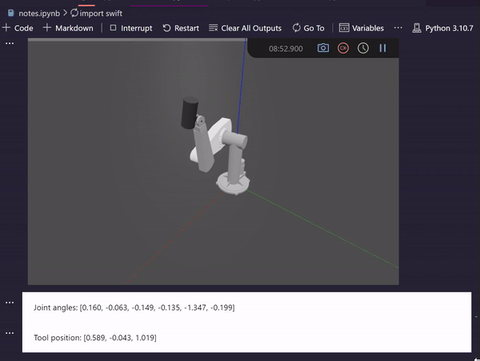

# Mortti bot

## Description
Mortti is puma560 robot arm owned by AS-guild. In this repository you can find python scripts for controlling and simulating the robot arm.

Note: Always simulate before running the robot arm! Shutdown button's wire is shorter than the robot arm's reach 💀

## Installation
1. Install python
2. jupyter notebook extensions etc
3. install requirements.txt TODO
4. Get wild with mortti

## Known issues
- Mortti's reach is not enough to press the shutdown button
- Roboticstoolbox uses swift library to render Mortti. There is small filepath parsing bug on windows. 
Fix: TODO add link to fix
